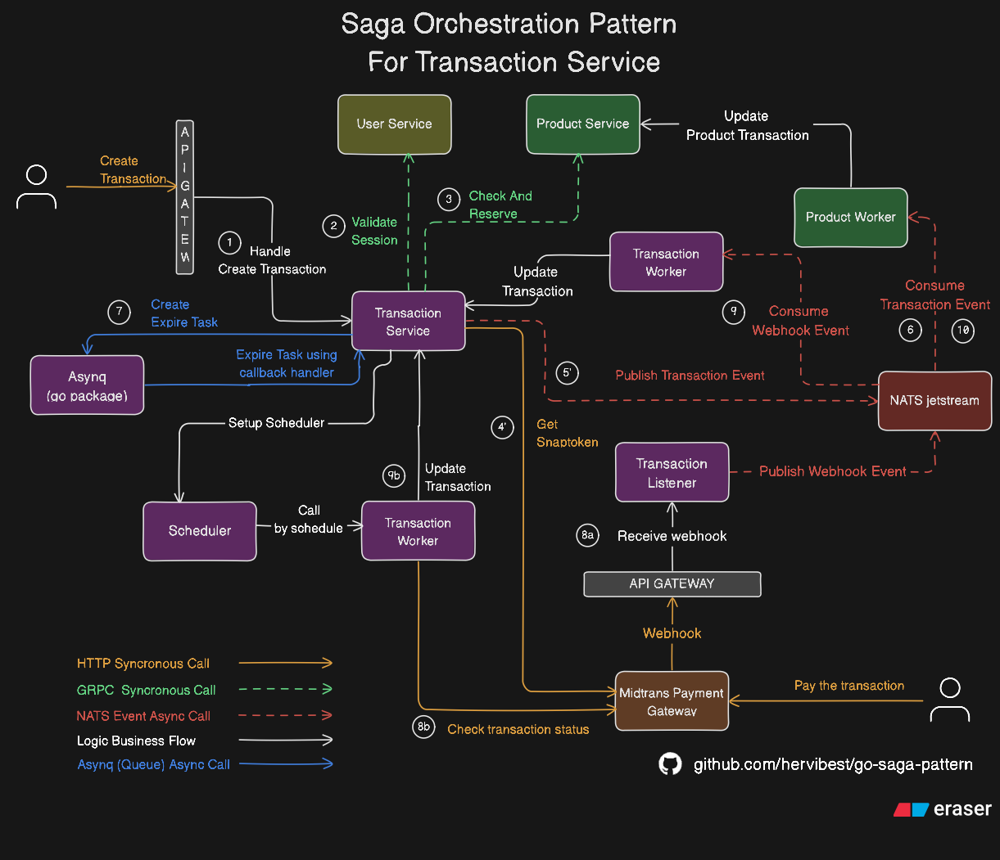

# 🧭 Saga Orchestration - Distributed Transaction System in Go

This project implements a distributed transaction system using the **Saga Orchestration Pattern**, written in **Go**, and integrates multiple components such as:

- gRPC microservices (User, Product, Transaction)
- Payment Gateway (Midtrans)
- Messaging (NATS JetStream)
- Background processing (Asynq + Redis)
- Stateless Webhook Listener

---

## 📌 Use Case: Transaction Checkout System

This system allows users to:
- Create transactions
- Reserve product stock
- Initiate payments via Midtrans
- Handle async status updates
- Automatically expire or settle transactions

---

## ⚙️ Architecture Overview



> See full architecture flow in `saga-flow.png`

---

## 🔁 Saga Orchestration Flow

### 1. 🛒 User Initiates Checkout

**Endpoint:**
**Payload:**
```json
{
  "products": [
    { "id": "product-123", "price": 10000, "quantity": 2 }
  ]
}
```

### 2. ✅ User Authorization (via gRPC)

- `Transaction Service` calls `User Service` using **gRPC**.
- User token is validated.
- If the user is not authorized, the process is stopped.

---

### 3. 📦 Product Check & Reservation (via gRPC)

- `Transaction Service` calls `Product Service` via **gRPC** with:
  - Generated transaction ID
  - Product IDs
  - Requested prices
  - Requested quantities

**Product Service Validations:**

- ❌ Product not found or mismatched → return error  
- ❌ Stock is 0 → throw use-case error  
- ❌ Requested quantity exceeds available → throw use-case error  
- ❌ Price mismatch → throw use-case error  

✅ If all validations pass:

- Stock is reserved (reduced)
- Reservation is saved as `ProductTransaction` with status: `reserved`
- Returns success response to `Transaction Service`

---

### 4. 💼 Business Logic & Snap Token (Midtrans)

- After reservation is confirmed:
  - Additional logic such as:
    - Total price calculation
    - Fee or discount processing
- `Transaction Service` sends HTTP request to **Midtrans Snap API**
- On success, receives a **Snap Token** which allows user to proceed with payment

---

### 5. 📡 Publish `committed` Event

- Once Snap Token is obtained:
  - `Transaction Service` publishes a `committed` event to **NATS JetStream**

**Example Payload:**
```json
{
  "transaction_id": "TXN-123456"
}
```

### 6. 🔄 Product Service Consumes Transaction Events

`Product Consumer` listens to transaction events from **NATS JetStream**.

It handles **4 types of events**:

| Event      | Description                            | Product Action                          |
|------------|----------------------------------------|------------------------------------------|
| `committed`| User is ready to pay (Snap Token issued) | Update product transaction to `committed` |
| `cancelled`| Checkout failed or aborted             | Mark as `cancelled` and restore stock     |
| `expired`  | Payment timeout                        | Mark as `expired` and restore stock       |
| `settled`  | User has successfully paid             | Mark as `settled` and finalize stock      |

---

### 7. ⏱️ Expiration Task via Asynq (Redis)

- Every `committed` transaction schedules an **expiration task** using [Asynq](https://github.com/hibiken/asynq)
- Task runs after a TTL (e.g. 15 minutes)
- If the user hasn’t paid:
  - Transaction is marked as `expired`
  - `expired` event is published to **NATS JetStream**

---

### 8. 🔄 Payment Status Handling

Two mechanisms run concurrently to check if the transaction has been paid:

#### 8A. 🔔 Midtrans Webhook (Listener Service)

- Midtrans sends webhook HTTP request to a **stateless Listener Service**
- Listener simply **publishes the webhook data** to `midtrans.payment_status` stream in **NATS JetStream**

#### 8B. 🧭 Polling via Scheduler (Transaction Service)

- A scheduler runs periodically to check all `committed` transactions
- It polls Midtrans API directly
- If payment is confirmed, transaction is marked as `settled`

---

### 9. ⚙️ Transaction Worker Finalization

- `Transaction Worker` consumes events from `midtrans.payment_status` (via NATS)
- It calls business logic:
  
```go
CheckAndUpdate(payload)
```
- Validates the webhook data
- Updates transaction status to settled
- Emits settled event to NATS JetStream

---

### 10. 📦 Final Product Update on Settlement
- Product Consumer receives the `settled` event
- Updates product transaction status to `settled`
- Stock is finalized and no longer reversible

## ✅ Summary: Saga Flow Overview

| Phase                  | Mechanism            | Technology Used         |
|------------------------|----------------------|--------------------------|
| Auth & Validation      | gRPC (sync)          | Go, gRPC                 |
| Stock Reservation      | gRPC + Logic         | Go, gRPC                 |
| Payment Initialization | HTTP API             | Midtrans Snap            |
| Messaging              | Event-driven         | NATS JetStream           |
| Expiry Enforcement     | Delayed Task         | Asynq (Redis)            |
| Payment Confirmation   | Webhook / Scheduler  | Midtrans, Go, NATS       |
| Final Update           | Consumer Worker      | Go Worker, Business Logic |

## 🧪 Tech Stack

- Go 1.20+
- gRPC
- Redis + Asynq
- NATS JetStream
- Midtrans Snap API
- PostgreSQL
- Docker / Docker Compose (optional)

---

## API Documentation
- [API Docs (Postman Docs)](https://documenter.getpostman.com/view/17668293/2sB2xEB8Yq)
